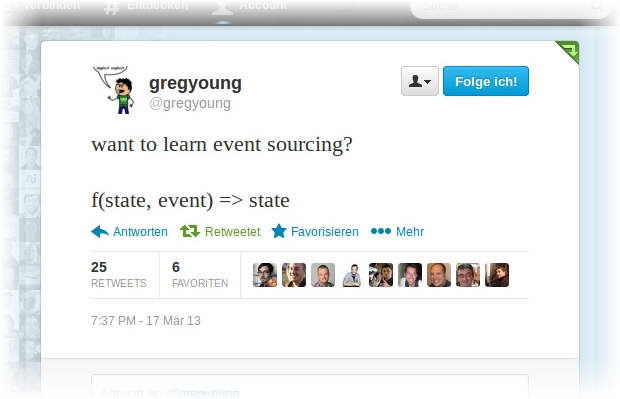
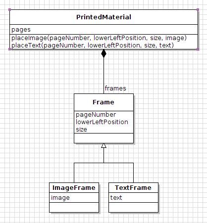
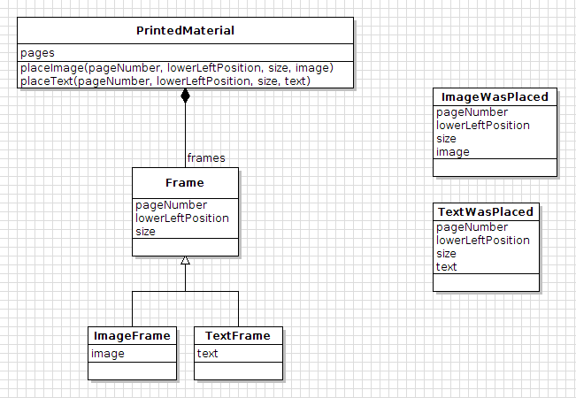

# What is Event Sourcing?

This post shall be the first episode of a larger story I want to tell.
The story deals with Domain-Driven Design, Event Sourcing, and REST.
But a good story starts with introducing the main characters.
So this one will make you familiar with "Event Sourcing".

Making a long story short, I quote [Greg Young](http://twitter.com/gregyoung):

That's all you have to know.

OK, just kidding :-)

# The Basic Idea
As an example, think of producing printed materials.
Our central model is the PrintedMaterial class.
We can add different frames to a printed material.
These frames hold the to-be-printed contents of the brochure / book / ….

The common persistence strategy is to map this object structure to some tables in a relational database and save the __current state__ of the model to the database.

The basic idea of Event Sourcing is not to persist the current state itself, but the __events__ that led to the __current state__.
This forces us to make the otherwise implicit __business events__ explicit in the model:

At first sight, this just introduces a new level of indirection, in order to place a new image, the following procedure takes place:

 1. Invoke `printedMaterial.placeImage(1, position(0, 0), size(18, 13), myFavoritePhoto)`
    
    <ol type="a">
    <li>Create a new event: <code>event = new ImageWasPlaced(1, position(0, 0), size(18, 13), myFavoritePhoto)</code></li>
    </ol>

 1. Apply the changes captured in the `event` to `printedMaterial`.
    (There are some choices on exactly _how_ we can implement this operation.
    I am planning to elaborate on these alternatives in the next post.)

But don't be so quick!

## The Benefits
If we persist the complete history of our current model's state, we can easily __re-create any earlier state__ by just applying all events up to that particular point in time.
If we serialize the attributes of the Events as JSON String, it is easy to write a mapping of events to a general `Events` database table.
Introducing new attributes or changing them becomes easier, because __we don't have to consider the database design__ for each change. (If you worry about query performance, you have to stay patient; at some point I'll discuss choices for dealing with it. Or you go ask Google ;-) )
Debugging production problems becomes easier, because we can investigate how the current state emerged from the events.
__Audit logging__ comes for free; because the events are the **source** of the state, they are guaranteed to be a complete audit log.

## Further Reading
If you want to go more in depth, I recommend reading [Martin Fowler's thorough Bliki article](http://martinfowler.com/eaaDev/EventSourcing.html).
